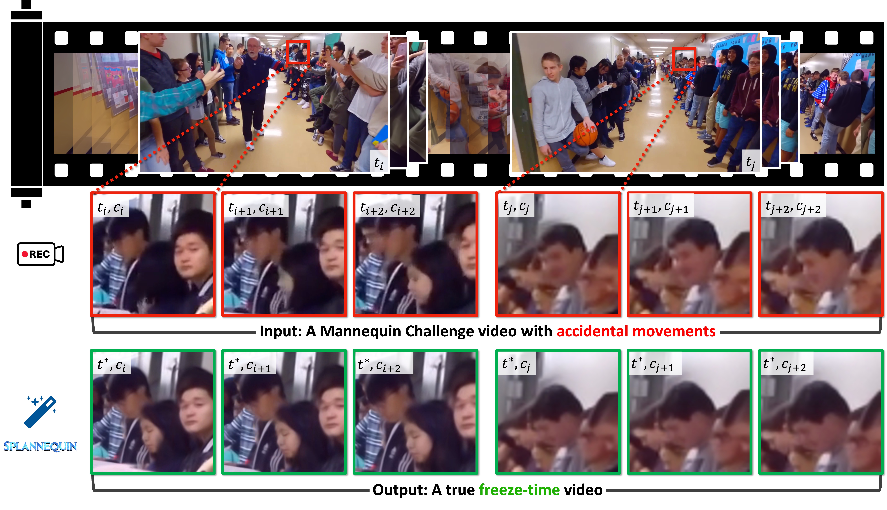

# Splannequin: Freezing Monocular Mannequin-Challenge Footage with Dual-Detection Splatting
## WACV 2026
### [Project Page](https://chien90190.github.io/splannequin/) | [arXiv Paper](https://arxiv.org/abs/2512.05113)



(Top) A monocular Mannequin-Challenge video is intended to resemble large-scale frozen frames, yet real-world recordings inevitably contain slight body movements. The red crops across successive frames (Ii) highlight these noticeable movements. (Bottom) After our processing, every crop (green boxes) of successive frames remains perfectly static. Splannequin analyzes the entire video and resynthesizes a temporally consistent sequence of views at t* while preserving overall visual fidelity.

## Environmental Setups

Please follow the [3D-GS](https://github.com/graphdeco-inria/gaussian-splatting) to install the relative packages.

```shell
git clone https://github.com/chien90190/splannequin-gs.git
cd splannequin-gs
mkdir models
git submodule update --init --recursive
conda create -n splannequin python=3.8 -y
conda activate splannequin

module load cuda/11.7
export CC=/usr/bin/gcc-10
export CXX=/usr/bin/g++-10

pip install -r requirements.txt
pip install -e submodules/depth-diff-gaussian-rasterization
pip install -e submodules/simple-knn
```


## Before Training

### Pre-trained Models
Download `EvaluationNet.pth.tar` following the instructions at [ViewEvaluationNet](https://github.com/zijunwei/ViewEvaluationNet) and place it in the `./models/` directory. This model is used for `aesthetic` evaluation mode.

### Splannequin Dataset
First, download the dataset metadata from [Hugging Face](https://huggingface.co/datasets/chien90190/Splannequin) to get `dataset.csv`.

Then, run the scripts to download frames and generate 3D reconstruction data:

```shell
# 1. Download frames from YouTube
python scripts/download.py

# 2. (Optional) Run COLMAP
python scripts/colmap.py ./data/splannequin --gpu
```
Due to YouTube encoding changes, downloaded frames may have slight temporal jitter compared to the original research data. `We strongly recommend running the COLMAP script` above to generate aligned camera poses, replacing any provided metadata.

The script will automatically organize the data into the required format:

```shell
video_folder/
├── images/       <-- Input
├── sparse/       <-- Output
├── database.db   <-- Output
```

### Prepare Your Own Data
To process your own videos, organize your data as follows:
```shell
my_video/
└── images/
    ├── 0001.png
    └── 0002.png
```

Then run the reconstruction script pointing to the parent folder:
```shell
python scripts/colmap.py path/to/my_video --gpu
```

## Training

For training a scenes such as `1.1` scene, run

```shell
bash scripts/train.sh ./data/splannequin/1.1
```

## Rendering

Run the following script to render the images. We provide several modes for rendering:

- `normal`: renders the scene as a video with regular time running.
- `fixed-time-view`: fix the entire scene in a single timestamp. 
- `time-sweeping-view`: select a view and then run the timestamps.
- `fixed-time-smooth`: fix the entire scene in a single timestamp with a interpolated original trajectory. 

```shell
# to run all timestamp indicies as the fixed time for the scene (every 8th timestamps)
bash scripts/render.sh ./exp/splannequin/1.1 

# to run selected timestamp indicies (every index corresponds to every 8th frames)
bash scripts/render.sh ./exp/splannequin/1.1 0,1,2,3,4
```

## Evaluation

You can just run the following script to evaluate the model. It runs `aesthetic` (ViewEvaluationNet), `musiq`, `topiq_nr`, `hyperiqa`, and `clipiqa`.

```
bash scripts/eval.sh ./exp/splannequin/1.1
```

### Evlauation by COVER
Follow the instruction in [COVER](https://github.com/taco-group/COVER) to process the videos.

## Contributions

**This project is still under development. Please feel free to raise issues or submit pull requests to contribute to our codebase.**


Some source code of ours is borrowed from [3DGS](https://github.com/graphdeco-inria/gaussian-splatting), [K-planes](https://github.com/Giodiro/kplanes_nerfstudio), [HexPlane](https://github.com/Caoang327/HexPlane), [TiNeuVox](https://github.com/hustvl/TiNeuVox), [Depth-Rasterization](https://github.com/ingra14m/depth-diff-gaussian-rasterization), [4DGaussians](https://github.com/hustvl/4DGaussians). We sincerely appreciate the excellent works of these authors.

## Citation

```
@InProceedings{chien2026splannequin,
  author    = {Hao-Jen Chien, Yi-Chuan Huang, Chung-Ho Wu, Wei-Lun Chao, Yu-Lun Liu},
  title     = {Splannequin: Freezing Monocular Mannequin-Challenge Footage with Dual-Detection Splatting},
  booktitle = {Proceedings of the IEEE/CVF Winter Conference on Applications of Computer Vision (WACV)},
  month     = {March},
  year      = {2026},
}
```
